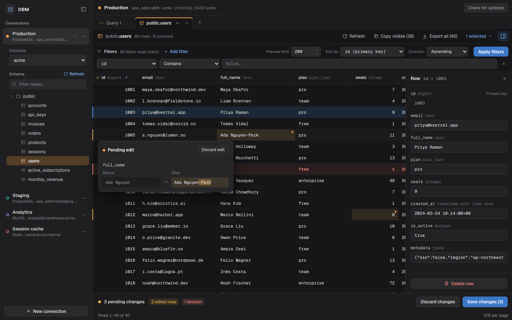
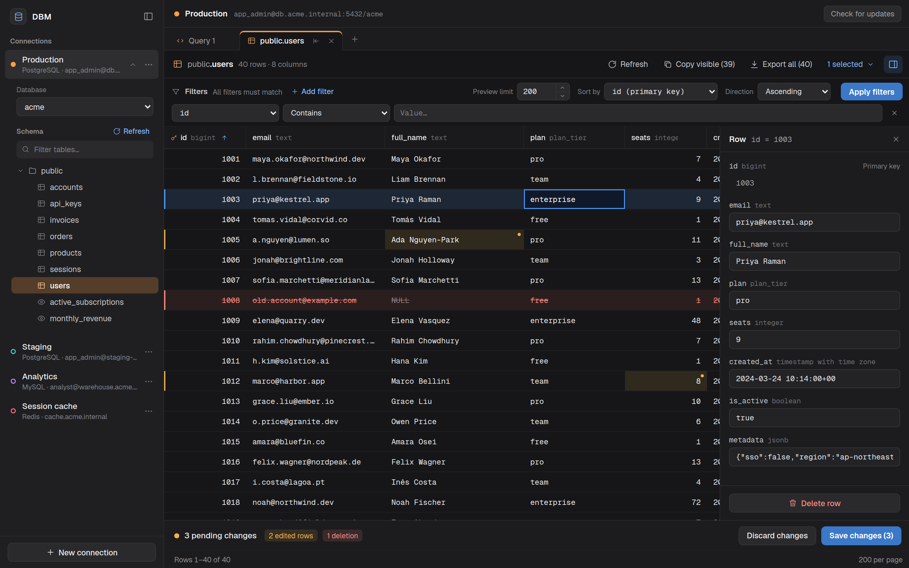
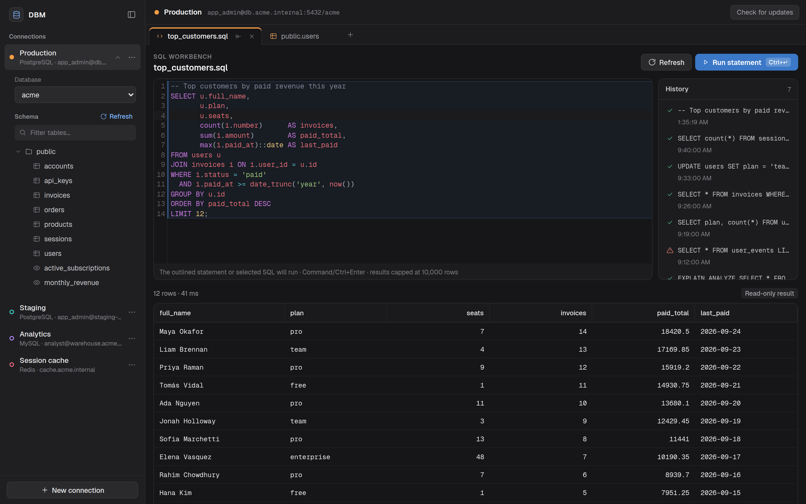
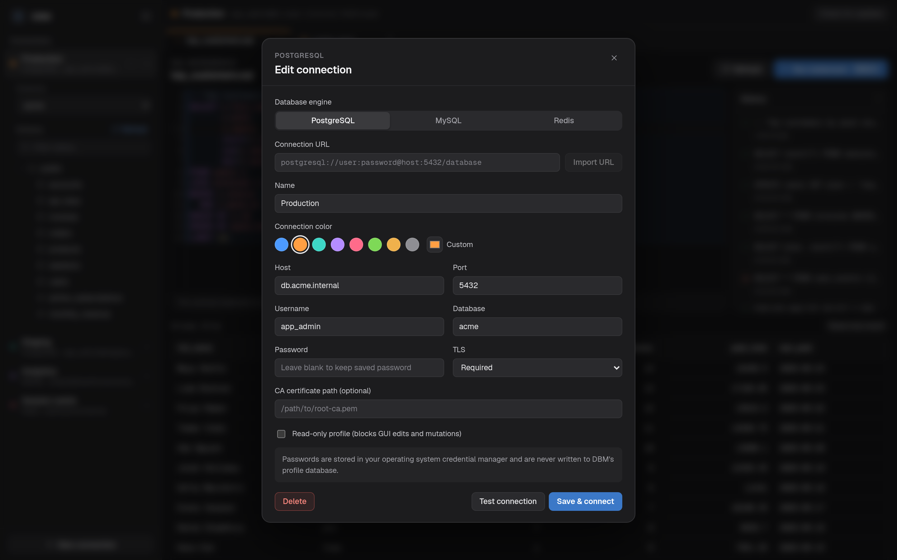
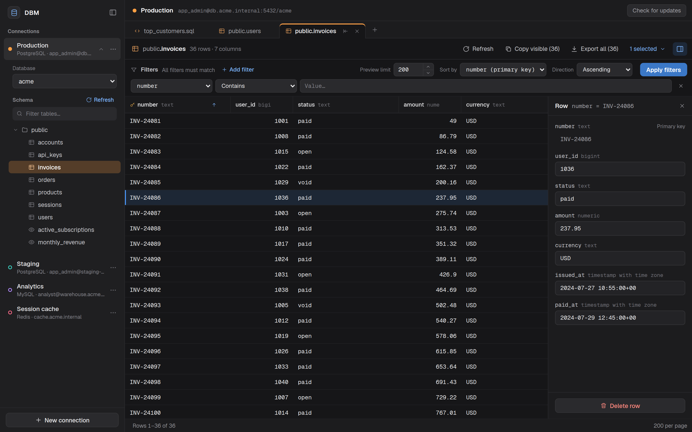

# DBM

A fast, local-first database manager for PostgreSQL, MySQL, and Redis on
macOS, Windows, and Linux.

**[Download the latest release →](https://github.com/joswayski/dbm/releases/latest)**
macOS `.dmg` · Windows `.exe` · Linux `.AppImage` / `.deb`. After the first
install the app updates itself (`.deb` installs link you to the new release).

| | |
| --- | --- |
|  |  |
|  |  |

## Features

- Browse databases, schemas, tables, and Redis keys, with filters, sorting, and
  CSV export.
- Edit rows safely: changes are staged, previewed, and saved together.
  PostgreSQL edits detect rows changed by someone else. Read-only profiles
  block writes.
- SQL and Redis workbench tabs with per-connection history.
- Color-coded saved connections, with passwords kept in your OS credential store.
- Your connections, history, and data stay on your machine: no telemetry,
  accounts, or sync.

See [docs/features.md](docs/features.md) for the full feature list and what is
planned.

> Windows installers are not code-signed yet, so SmartScreen may warn on first
> install. The macOS app is signed and notarized.

## Docs

- [Development](docs/development.md): build from source, run tests, local installs
- [Releases](docs/releases.md): how releases and in-app updates work
- [Design system](docs/design-system.md): the Graphite UI
- [Native development preview](docs/native.md): Rust core and experimental macOS AppKit workbench; the downloads above still use Tauri
