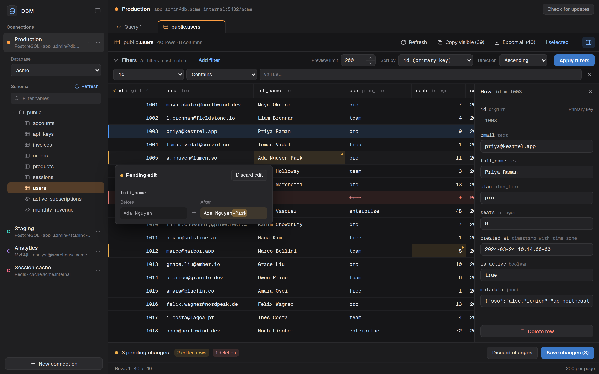
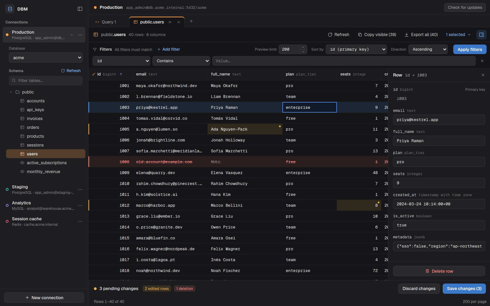
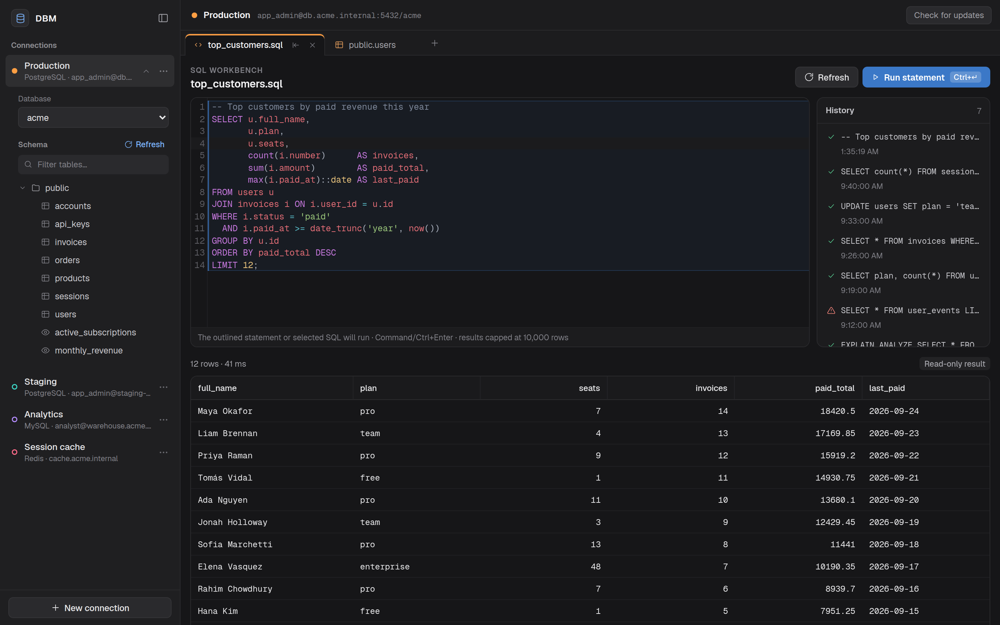
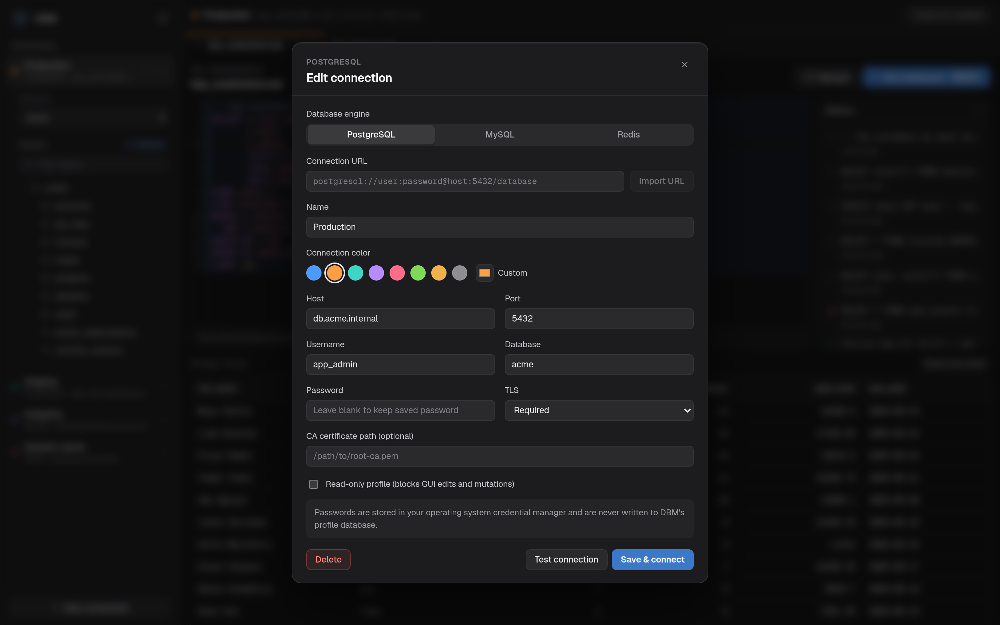
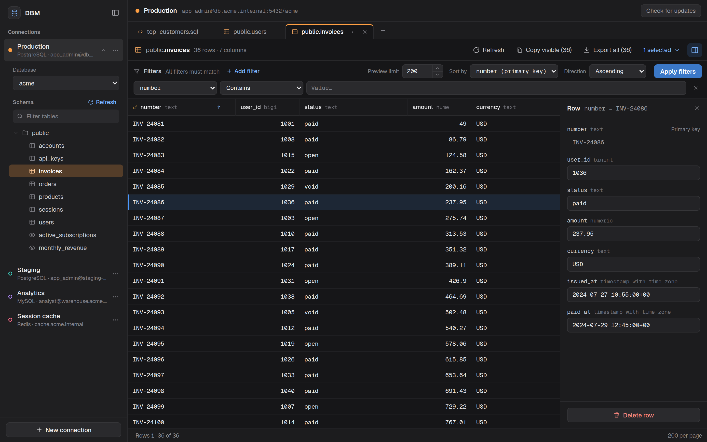

# DBM

A fast, local-first database manager for PostgreSQL, MySQL, and Redis. Native
desktop apps are released for macOS, Windows, and Linux; Android Compose and
iPhone SwiftUI clients are in development.

## Download

| Platform | Direct download |
| --- | --- |
| macOS (Apple Silicon and Intel) | [Download DMG](https://github.com/joswayski/dbm/releases/latest/download/DBM-macOS.dmg) |
| Windows (x64) | [Download installer](https://github.com/joswayski/dbm/releases/latest/download/DBM-Windows-x64-setup.exe) |
| Linux (x86_64) | [Download AppImage](https://github.com/joswayski/dbm/releases/latest/download/DBM-Linux-x86_64.AppImage) |

> The Windows installer is not code-signed yet, so SmartScreen may warn on
> first install. The macOS app is signed and notarized.

| | |
| --- | --- |
|  |  |
|  |  |

## Features

- Released desktop apps use AppKit on macOS and egui on Windows/Linux.
- Browse databases, schemas, tables, and Redis keys, with filters, sorting, and
  CSV export.
- Edit rows safely: changes are staged, previewed, and saved together.
  PostgreSQL edits detect rows changed by someone else. Read-only profiles
  block writes.
- SQL and Redis workbench tabs with per-connection history.
- Color-coded saved connections, with passwords kept in your OS credential store.
- Remembered database selections and per-connection **Open on startup** settings.
- Your connections, history, and data stay on your machine: no telemetry,
  accounts, or sync.

The mobile development clients are a deliberately smaller, read-only slice.
They connect directly through the in-process Rust core, require verified TLS,
and do not save passwords. They are not public store releases. A separate
Caper-style release workflow delivers Android through Google Play internal
testing and iPhone through TestFlight after the one-time signing/app setup. See
[the mobile contract](docs/mobile.md) for capabilities, privacy, networking,
builds, and validation status.

See [docs/features.md](docs/features.md) for the full feature list and what is
planned.

## Docs

- [Development](docs/development.md): build from source, run tests, local installs
- [Releases](docs/releases.md): how releases and in-app updates work
- [Design system](docs/design-system.md): the Graphite UI
- [Native architecture](docs/native.md): the shared Rust core and native hosts
- [Mobile development clients](docs/mobile.md): Android Compose and iPhone SwiftUI scope
- [AnyBase migration checklist](docs/anybase-migration.md): planned rename; not yet applied
